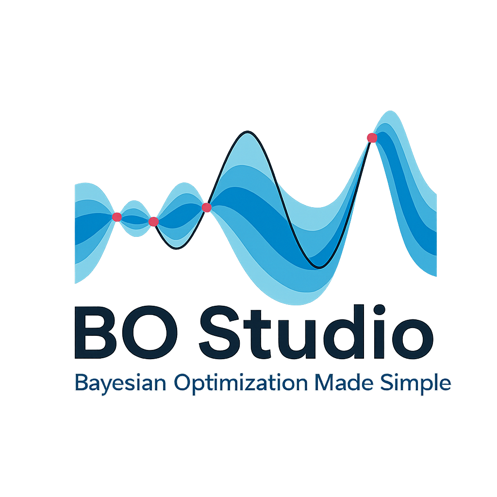

# Streamlit_VOL

**Streamlit_VOL** (Virtual Optimization Laboratory) is an interactive Streamlit app designed to visualize and run Bayesian Optimization experiments for chemical process optimization in real time.

---

## 🚀 Features

- 🚀 Run **Single-Objective Bayesian Optimization** (Real, Hybrid, or Simulated)
- ⚖️ Perform **Multi-Objective Bayesian Optimization**
- 🎯 Use **Design of Experiments (DoE)** to structure offline campaigns
- 🔌 Connect to **real hardware systems via OPC** for live control and data acquisition
- 🧠 Perform both **automated** and **manual optimization campaigns** 
- 🔁 **Stop/Resume** any campaign — and even recover from hardware failures
- 💾 **Save and Reload** optimization runs (pick up where you left off!)
- 🗂️ Store experiment results in a **structured database** following the **FAIR principles**
- 🧠 Soon: Use **Previous Campaigns as Starting Points** (Active Learning)
""")
---

